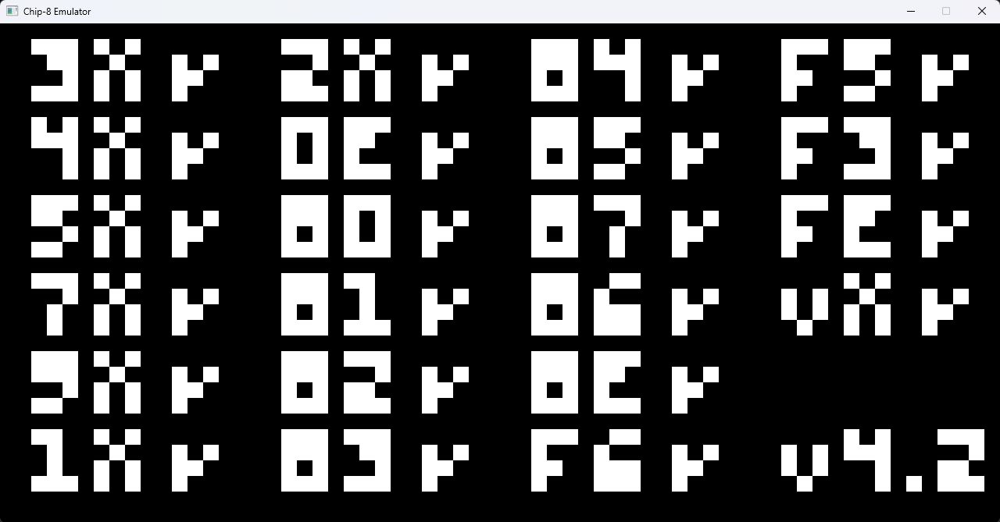
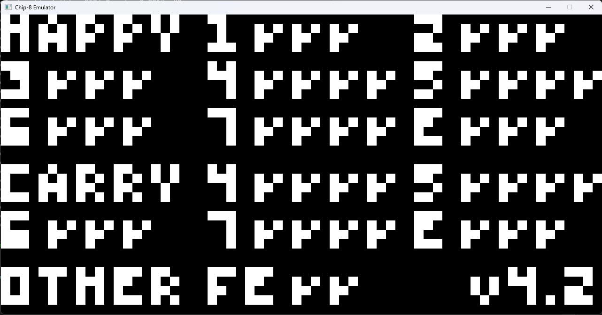

# CHIP-8 Emulator

A CHIP-8 emulator written in C++20 using Raylib for graphics, Raygui for GUI, and Native File Dialog for file selection. The project is built with CMake and Ninja.

## Features

- CHIP-8 emulation (CPU, memory, display, keypad)
- ROM loading via file dialog
- Pause menu with load/quit options
- Debug window for registers, stack, and opcode history
- Sound support

## Libraries Used

- [Raylib](https://www.raylib.com/) — graphics, windowing, input, and audio
- [Raygui](https://github.com/raysan5/raygui) — GUI widgets for menus and dialogs
- [Native File Dialog (NFD)](https://github.com/mlabbe/nativefiledialog) — cross-platform file dialog
- [spdlog](https://github.com/gabime/spdlog) — logging (if present in your codebase)

## Installation

### Prerequisites

- C++20 compatible compiler (MSVC, Clang, GCC)
- [CMake](https://cmake.org/) >= 3.8
- [Ninja](https://ninja-build.org/) (recommended for fast builds)

### Building

1. **Clone the repository:**
git clone https://github.com/Ghostleadie/Chip8-Emulator.git cd <your-repo-folder>
2. **Configure the project with CMake:**
cmake -S . -B build -G Ninja
3. **Build the project:**
cmake --build build
4. **Run the emulator:**
- The executable will be in the `build` directory (e.g., `build/chip8.exe` or `build/chip8`).

or just clone and run the cmake gui.

### Windows Notes

- All dependencies (Raylib, Raygui, NFD, spdlog) are included via CMake and built automatically.
- If you encounter missing DLLs, ensure Raylib and NFD are built as static libraries or copy the DLLs to your executable directory.

### Linux/macOS Notes

- You may need to install development packages for X11, OpenGL, and audio (see Raylib documentation).
- All dependencies are handled by CMake; no manual installation required.

## Usage

- Launch the emulator.
- Use the menu to load a `.ch8` ROM file.
- Use the pause menu (`Space` or `P`) to pause, load a new ROM, or quit.
- Use the debug window (toggle with `` ` ``) to inspect CPU state.

## License

This project is released under the MIT License.

---

**Libraries used:**
- Raylib
- Raygui
- Native File Dialog (NFD)

**Build system:**  
- CMake (minimum version 3.8)
- Ninja (recommended)

**Language standard:**  
- C++20

